# Introduction

I was looking for a cat face landmark predictor to use in one of my projects. After a quick search I realized there is
no out-of-the-box solution with a high enough accuracy. The closest I found was
[cat_hipsterizer](https://github.com/zylamarek/cat_hipsterizer).
I tested the predictor included in the repo and decided its accuracy needs some improvement.
This is how **frederic** was born.

The predictor consists of two models stacked on each other. The first one predicts the ROI (bounding box)
and the second one detects landmarks inside the ROI. The detected landmarks are then translated into the original image.
I train the models on [an improved version of cat-dataset](https://github.com/zylamarek/cat-dataset).
The predictor assumes that there is one and only one cat in the picture.

[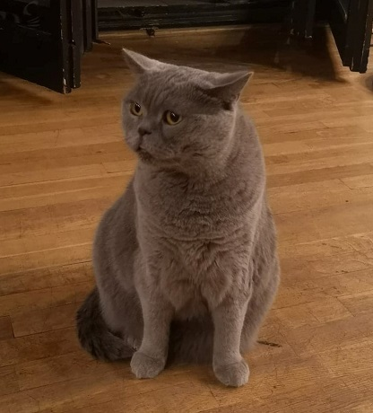](./graphics/frederic.jpg)
[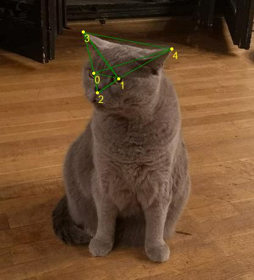](./graphics/frederic_predicted.jpg)

*Fryderyk - the cat behind the name of this project.
Predicted landmarks are presented as yellow dots
(0 - right eye, 1 - left eye, 2 - mouth, 3 - right ear, 4 - left ear).*

## Installation

**Frederic** hasn't been distributed as a package, so the only way to use it (at least for now)
is to get a copy of this repo by either `git clone` or download.

It requires keras and Pillow in order to run. You may use the convenience scripts provided:
`winstall.bat` on Windows or `install.sh` on Linux. They will create a new conda
environment with all the necessary packages installed. You may want to adjust the keras
version (GPU vs CPU) and CUDA version that is supported by your system.
You can get Miniconda from [here](https://docs.conda.io/en/latest/miniconda.html).

Then you need to make sure that **frederic** can be found by your interpreter.
One way to achieve it is to set the PYTHONPATH environment variable:
`set "PYTHONPATH=C:\path\to\frederic"` on Windows or
`export PYTHONPATH="/path/to/frederic"` on Linux.

## Usage

Once **frederic** is successfully installed you can run this example:

```python
import frederic

img_path = '/path/to/an/image.jpg'
img = frederic.load_image(img_path)
predictor = frederic.Predictor()
landmarks = predictor.predict(img)
frederic.save_landmarks(landmarks, img_path + '.cat')
frederic.draw_landmarks(img, landmarks)
frederic.save_image(img, img_path + '.landmarks.png')
```

The above code will load an image, predict landmarks, save them in a '.cat' file
and save a copy of the image with landmarks drawn in it.
Running the predictor for the first time will also download the necessary trained models
and store them in keras' cache.

Please note that loading the models is a relatively expensive operation. In the above example
the models are loaded only when the `predict` method is called, not when the predictor
is created. You can control this behavior with the `lazy` parameter of the constructor.
With `lazy=False` the models are loaded upon predictor creation, so the consequent
call to `predict` method will happen without delay.

## Performance

**An average error of each landmark along any axis is 2.07 pixels or 1.6% of a cat face size.**

The first table presents the performance of the whole pipeline. MAE and RMSE values are expressed in pixels,
MSE in pixels squared, MAPE and RMSPE in percent.
Percentage values were obtained by dividing each error by the length of the longer edge of
the bounding box of the given face.

Whole pipeline | train | validation | test
--- | --- | --- | ---
MAE | 1.59 | 2.09 | **2.07**
MSE | 13.24 | 17.87 | 76.23
RMSE | 3.64 | 4.23 | 8.73
RMSPE | 8.50 | 3.22 | 20.32
MAPE | 0.81 | 1.11 | **1.60**
MAPE eyes | 0.71 | 0.78 | 1.28
MAPE mouth | 0.74 | 0.95 | 1.37
MAPE ears | 0.96 | 1.52 | 2.04

Images below show examples of predicted landmarks with MAPE close to 1.6 (average error of the whole pipeline).

[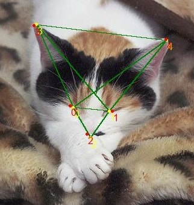](./graphics/1.582818924_00001472_019.jpg)
[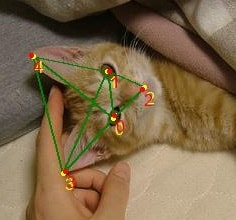](./graphics/1.611532178_00001395_015.jpg)
[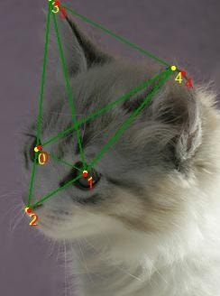](./graphics/1.611642589_00001425_023.jpg)
[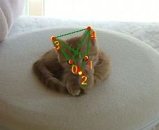](./graphics/1.646175463_00001385_011.jpg)

*Examples of predicted landmarks with MAPE close to 1.6.
Ground truth landmarks are presented in red and predicted landmarks in yellow. Landmarks are labeled: 0 - right eye,
1 - left eye, 2 - mouth, 3 - right ear, 4 - left ear.*

We can see that RMSPE is much higher than MAPE.
This happens, because RMSPE punishes large errors incomparably more than the small ones.
The image below presents the worst prediction in the test set.
Indeed, MAPE in this case equals to 720% (the second worst one is 36%).
Due to a terribly wrong ROI prediction the landmarks are off by a huge margin.
Interestingly, this single image has a huge influence on the total metrics.
If we removed this image completely from the test set MAPE drops down to 1.05 (from 1.6)
and RMSPE to 2.62 (from 20.32).

[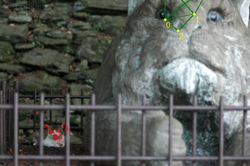](./graphics/719.892645700_CAT_06_00001440_008.jpg)

*The worst prediction in the test set*

The table below depicts results of the bounding box (ROI) prediction model. MSE, RMSE, MAE and MAPE were computed for
two points: top-left and bottom-right corner of the bounding box. Intersection over union (IoU) of
the predicted and ground truth boxes is presented in percent.

Bounding box | train | validation | test
--- | --- | --- | ---
IoU | 94.38 | 93.72 | **93.88**
MAE | 0.91 | 1.59 | 1.68
MAPE | 1.50 | 1.62 | 2.06
MSE | 2.51 | 9.15 | 20.29
RMSE | 1.58 | 3.02 | 4.50

The last table shows the performance of the landmarks-inside-ROI predictor. The scores were computed using
the ground truth bounding boxes.

Landmarks | train | validation | test
--- | --- | --- | ---
MAE | 1.29 | 1.59 | **1.55**
MAPE | 0.69 | 0.86 | 0.84
MSE | 2.97 | 6.79 | 7.71
RMSE | 1.72 | 2.61 | 2.78

## Training

To train the models yourself you should first get a copy of [augmented cat-dataset](https://github.com/zylamarek/cat-dataset).
Move the data into the parent directory of your **frederic** copy or adjust the data path in the script.
Then run `hpsearch.bat` on Windows or `hpsearch.sh` on Linux. This will train new models and place them in the `tools/models` directory.

In order to use your models for prediction you can pass the path in the `Predictor` construction call, e.g.

```python
predictor = frederic.Predictor(bbox_model_path='/path/to/models/2019-10-07_11.35.58_iou.h5',
                               landmarks_model_path='/path/to/models/2019-10-04_12.56.47_mse.h5')
```

## Structure

The predictor consists of two models - ROI predictor and landmarks-inside-ROI predictor.
Both models have similar structure. They accept 224x224 RGB images as inputs. These are fed into
a [keras implementation](https://github.com/JonathanCMitchell/mobilenet_v2_keras)
of [MobileNetV2](https://arxiv.org/abs/1801.04381) pretrained on imagenet.
The fully-connected layer on top is discarded and global max pooling is applied.
The resulting vector of 1280 numbers is then passed to two stacked fully-connected layers
with relu nonlinearity and 128 units each. The last dense output layer applies no nonlinearity.
The difference between the models is the size of the output - 4 or 14 for bounding box prediction
and 10 for landmark prediction.

Training the bounding box predictor with MSE loss renders decent results. Using IoU loss (defined as `1 - IoU`)
increases the performance, but is unstable in the beginning of the training. To mitigate this issue I first
train the model with MSE loss for a couple of batches and then switch to IoU. I also tried training using joined
loss of IoU and MSE of landmarks in hope of achieving higher accuracy and stabilizing the process, but neither
actually happened (BTW that explains the size of the output being 14 = 4 for bounding box + 10 for landmarks).

The landmarks predictor is trained with MSE loss. Both models are trained using Adam optimizer,
which does a great job in this setting.

During training the data is augmented with horizontal flipping, rotation and cropping. The last part
turned out to be the most beneficial as it allowed to feed the network with scale balanced images.
I defined scale as a ratio between the longer bounding box edge and the longer picture edge.

The figures below show the distributions of scales during training using different cropping solutions.
Random rotation (+- 15 degrees) was also applied in all cases.
You can see that the dataset is highly imbalanced with most pictures scaled between 0.1 and 0.5.
Random crop without extending the image is still imbalanced.
Forcing the uniform distribution and extending the image with a black background does not improve the performance much.
The last solution is the most interesting. It is rather a hack than a proper technique and it works
only with this particular data. However, it brought a high accuracy gain.

[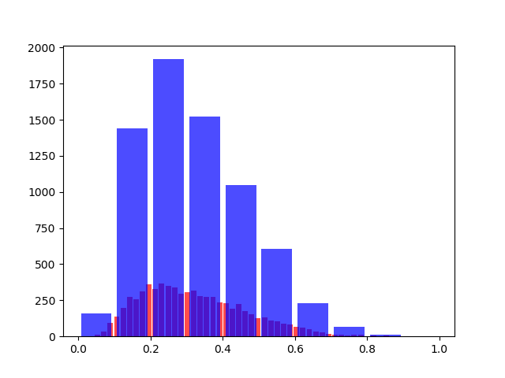](./graphics/rotate_15_no_crop.png)

*No crop*

[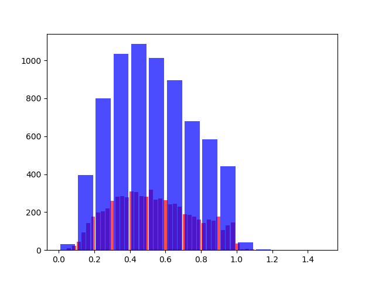](./graphics/rotate_15_crop.png)

*Random crop, not extending the image*

[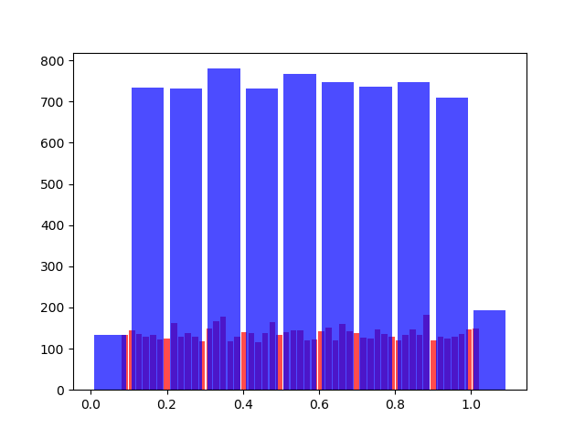](./graphics/rotate_15_crop_scale_balanced_black.png)

*Random crop with uniform distribution of scales, extending the image with black background if necessary*

[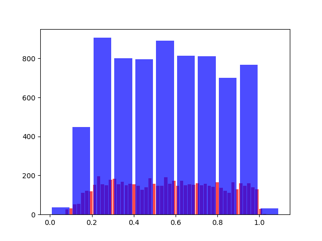](./graphics/rotate_15_crop_scale_balanced.png)

*Random crop with close to uniform distribution of scales, not extending the image*

I tried applying a couple of ideas to improve the results, but they didn't bring any performance gains.
I describe them below.

Authors of [this paper](https://arxiv.org/abs/1905.00641) report that including landmarks information in training
improves face detection. I tried including landmarks in the loss function together with the bounding box data, but
it failed to boost the accuracy.

In the same paper authors use landmarks normalization based on the center of the anchor. I tried normalizing
the landmarks around the center of the face, but it didn't improve the performance.

The output of the network is a number between 0 and 224 (most of the cases - some landmarks lay outside of the image).
I tried scaling the output to different ranges ([0;1], [-1;1], [-0.5;0.5], [0.25;0.75]) with linear or sigmoid/tanh
functions, but I was unable to achieve a higher score.

I tried including [this implementation](https://github.com/bojone/keras_lookahead)
of [Lookahead](https://arxiv.org/abs/1907.08610) and
[this implementation](https://github.com/CyberZHG/keras-radam) of [Rectified Adam](https://arxiv.org/abs/1908.03265).
Neither of them was able to improve the results.

Utilizing [DenseNet121](https://arxiv.org/abs/1608.06993) instead of much smaller MobileNetV2 did not increase the accuracy.
It actually rendered similar results.

Using float outputs instead of integers resulted in a slightly worse performance.

Training with RMSprop, SGD or Adam with differential learning rates led to a lower performance.
